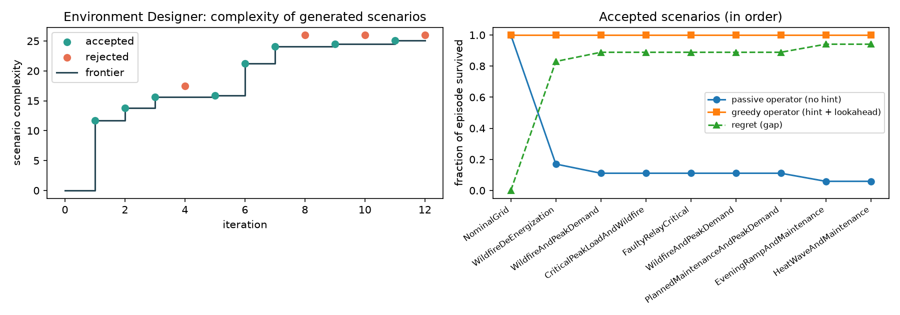

# SPADE Environment Designer for Power Grids (Grid2Op)

INFO 7375 Self-Improving AI, Assignment 1: Environment Designer.

This project implements the **Environment Designer** loop from
[SPADE: Self-Play in Adaptive Synthetic Executable Environments](https://arxiv.org/abs/2608.19197)
for the power-systems domain, using [Grid2Op](https://github.com/Grid2op/grid2op) (actively developed;
last commit on `master` in June 2026, pushes in September 2026). An LLM writes **executable Python
scenarios** that stress the IEEE 14-bus grid, and the loop progressively accepts **more complex,
still-survivable** scenarios. No policy is trained; the focus is the designer.

## How it maps to SPADE

| SPADE component | This project |
|---|---|
| Environment Designer writes an environment as executable code with `reset()`/`step()` | The LLM writes a `GridScenario` subclass (static stress + `events(rng)` + `load_multiplier(t)`); `GridScenarioEnv` turns it into a Gym-style `reset()`/`step()` environment on a real Grid2Op grid |
| Environment-generation prompt (Appendix C.1) | `spade_grid2op/designer.py` follows the C.1 structure: role, task, grounding, rules, difficulty requirements, interface contract, robustness rules, fenced ```python answer |
| Corpus grounding | Each iteration samples one power-system document (N-1 contingency, heat wave, storm, wildfire de-energization, ...) from `spade_grid2op/corpus.py` |
| Accumulated environment memory | Accepted scenarios, with their measured results, are summarized in every prompt, and the current frontier's code is shown in full |
| Hint-based regret, reward(agent with hint) − reward(agent without hint) | `regret = survival(greedy operator with the hint) − survival(passive operator)`. The hinted operator gets the scenario's outage schedule and stress-tests every candidate action against it with Grid2Op's simulator |
| Feasibility (unsolvable environments teach nothing) | Rejected unless the hinted operator survives ≥ 60% of the episode |
| Executability checks | Restricted `exec` (no imports, file or network access), timeouts, contract validation (bounds, line ids, determinism), and up to 2 repair rounds that feed the error back to the LLM |

### The loop (`run_designer.py`)

```
memory = [nominal seed scenario]
for each iteration:
    doc      = sample(corpus)
    prompt   = C.1-style prompt(doc, grid description + N-1 knowledge, memory, frontier code,
                                feedback on last attempt, complexity target = frontier + [1.5, 6])
    code     = LLM(prompt)                      # repair up to 2x on execution/contract/curriculum errors
    scenario = exec(code) -> validate
    eval     = passive vs hinted operator on 2 chronics (Grid2Op + LightSim2Grid)
    accept if feasible  and  regret >= 0.15  and  complexity > frontier
    else     give specific feedback (too easy / infeasible / not more complex) to the next prompt
```

`complexity` is an interpretable structural score: number of distinct outages, number of distinct
lines, temporal clustering of outages, load and thermal stress, the size of the demand peak, and
whether demand varies over time (see `run_designer.py`).

## Experiments with the environment library

1. **N-1 contingency analysis** (`experiments/n1_analysis.py` → `results/n1_analysis.md`): each of the
   20 lines is tripped alone. For a passive operator, lines 6, 8, 9, 15, 17, 18 and 19 are critical, and
   tightening thermal limits by 5% makes lines 3, 11 and 16 critical too. The hinted greedy operator
   survives every single outage. These findings are given to the designer as grid knowledge.
2. **Difficulty knobs**: +20–30% load collapses the grid for *every* operator (topology control cannot
   shed load), and thermal limits below about 0.85 collapse it immediately. That is why the contract
   bounds are `LOAD_SCALE ∈ [0.8, 1.25]` and `THERMAL_SCALE ∈ [0.85, 1.0]`, and why the prompt steers the
   designer toward well-timed outages instead of brute force.
3. **Hinted-operator bug found during experiments**: a first version of the hinted operator knew that an
   outage was coming but did not include it in its lookahead, so it pre-emptively split a substation and
   the scheduled outage then islanded the grid. Stress-testing each candidate action against the hinted
   outages fixed this (see `GreedyHintedAgent._score`).

## Results

One 12-iteration run with `qwen2.5:7b` via Ollama on a MacBook Air (M4, 16 GB): about 22 minutes,
about 105 s of LLM time per iteration, 7 repair rounds in total, and 0 unexecutable scenarios.



| iter | grounding document | scenario | complexity | passive survival | hinted survival | regret | decision |
|---:|---|---|---:|---:|---:|---:|---|
| 0 | - | NominalGrid (seed) | 0.0 | 100% | 100% | 0.00 | seed |
| 1 | Wildfire de-energization | WildfireDeEnergization | 11.7 | 17% | 100% | 0.83 | accept |
| 2 | Wildfire de-energization | WildfireAndPeakDemand | 13.8 | 11% | 100% | 0.89 | accept |
| 3 | N-1 contingency | CriticalPeakLoadAndWildfire | 15.6 | 11% | 100% | 0.89 | accept |
| 4 | Planned maintenance | CriticalPeakAndPlannedMaintenance | 17.5 | 11% | 50% | 0.39 | reject: infeasible |
| 5 | Protection misoperation | FaultyRelayCritical | 15.9 | 11% | 100% | 0.89 | accept |
| 6 | Wildfire de-energization | WildfireAndPeakDemand | 21.2 | 11% | 100% | 0.89 | accept |
| 7 | Planned maintenance | PlannedMaintenanceAndPeakDemand | 24.1 | 11% | 100% | 0.89 | accept |
| 8 | Protection misoperation | FaultyRelayAndPeakLoad | 26.0 | 6% | 50% | 0.44 | reject: infeasible |
| 9 | Evening ramp | EveningRampAndMaintenance | 24.5 | 6% | 100% | 0.94 | accept |
| 10 | Storm damage | StormDamageAndPeakLoad | 26.0 | 6% | 50% | 0.45 | reject: infeasible |
| 11 | Heat wave | HeatWaveAndMaintenance | 25.1 | 6% | 100% | 0.94 | accept |
| 12 | Planned maintenance | PlannedMaintenanceAndHeatWave | 26.0 | 6% | 50% | 0.45 | reject: infeasible |

Observations:

- **Progressive complexity.** The frontier rises monotonically from 0 to 25.1 over 8 accepted
  scenarios: from a single wildfire shut-off, to outages combined with demand peaks, to the final
  scenario (`results/envs/08_HeatWaveAndMaintenanceScenario.py`), which combines 12 outages over 10
  distinct lines, +12% demand, 10% tighter thermal limits, and an afternoon peak.
- **Staying at the frontier.** Every accepted scenario makes the passive operator fail early (6–17%
  survival) while the hinted operator survives the whole day, so regret rises from 0 to 0.94.
- **The feasibility check matters.** All four rejections are scenarios that overshot what even the
  hinted operator can survive (50%). Around complexity 25–26 the designer keeps hitting that wall,
  which suggests this is roughly the capability frontier of the fixed greedy operator. In full SPADE,
  a Reasoning Agent trained on these scenarios would push this frontier further.
- **Grounding produces diversity.** Seven different grounding documents led to thematically different
  scenarios (wildfire, relay misoperation, evening ramp, heat wave), each using the documented critical
  lines in a different way.

Accepted scenario code is in `results/envs/`, every attempt (including prompts' feedback and repair
errors) is in `results/log.jsonl`, and the N-1 table is in `results/n1_analysis.md`.

## Run it

```bash
python3.13 -m venv .venv && source .venv/bin/activate
pip install -r requirements.txt
# LLM: a local model served by Ollama (free); any OpenAI-compatible model would also work
brew install ollama && ollama serve &   # then:
ollama pull qwen2.5:7b
python experiments/n1_analysis.py       # optional: the N-1 experiment
python run_designer.py --iterations 12  # writes results/{log.jsonl,archive.json,envs/}
python plot_progress.py results         # writes results/progress.png
```

Use `SPADE_MODEL` to choose another Ollama model. Grid2Op's bundled test data (`test=True`) is used,
so nothing else is downloaded.

## Repository layout

```
spade_grid2op/scenario.py   GridScenario contract, sandboxed loader, validator, Gym-style GridScenarioEnv
spade_grid2op/evaluate.py   passive vs hinted operators, hint-based regret, feasibility
spade_grid2op/designer.py   C.1-style prompt, Ollama client, code extraction
spade_grid2op/corpus.py     grounding documents
run_designer.py             the Environment Designer loop
plot_progress.py            figure of the frontier over iterations
experiments/n1_analysis.py  N-1 contingency experiment
results/                    logs, accepted scenario code (results/envs/), figures
```

## Limitations

- A 7B local model often overshoots the complexity target and needs repair rounds; a stronger model
  would converge faster.
- Difficulty is estimated with two fixed heuristic operators on two chronics, not a trained RL agent,
  so "regret" is a proxy.
- The scenario interface (static stress, outage schedule, demand profile) is narrower than SPADE's
  arbitrary Python environments. This keeps generated code executable and verifiable on a real
  power-flow simulator.

## AI assistance

Developed with assistance from Claude Code (Anthropic).
